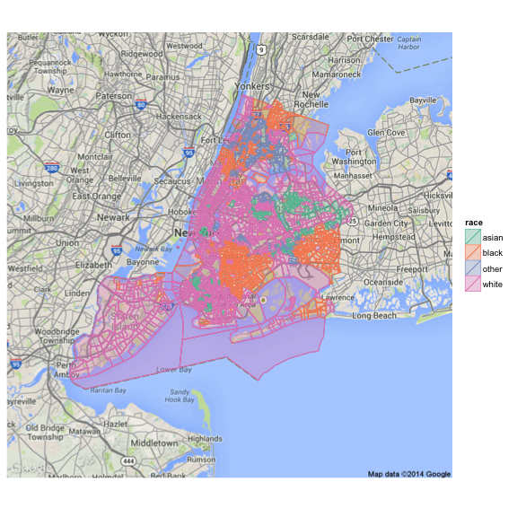
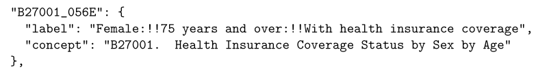
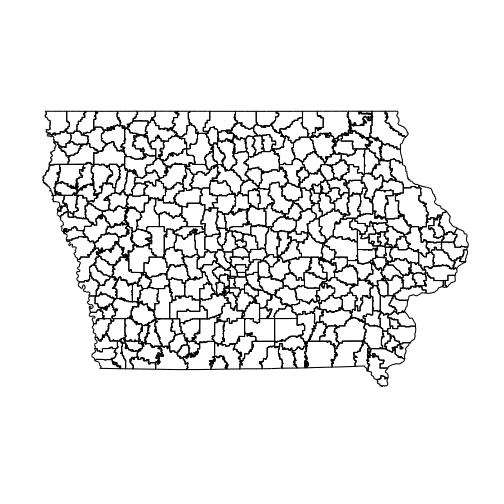
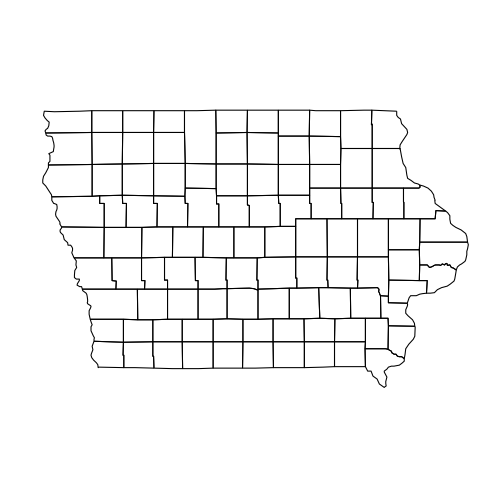

Working with the online API of the Census Bureau
========================================================
author: Alex Shum, Heike Hofmann, Eric Hare
date: August 2014


Online access to Census Bureau data
===

* API to  access data released about three years ago, providing at first access to the 2010 Decennial Census
* Additional data accessible since, among others American Community Survey
* API allows access to manageable pieces of the surveys, reduces load of data handling for users
* Access to data for web developers, ... and statisticians in their familiar computational environment

An example: majority races in Brooklyn's Census tracts
========================================================


View of Brooklyn, NYC; tracts are highlighted according to majority race

Mashup of google maps and census API in R


Access to data collected through Census Bureau
========================================================

Various tools allow access at different levels

* individual/few numbers: Factfinder, Quickfacts
  - http://factfinder2.census.gov/
  - http://quickfacts.census.gov/
* subsets/slices of population with Data Ferrett:  
  - http://dataferrett.census.gov/
* entire datasets (GB of data) through ftp

API aims at medium level of data quantity: not just individual numbers, not whole population either

Online API
========================================================
- Can be accessed at: http://api.census.gov
- Request data as an HTTP GET request.
- Results in JSON file format

- Basic structure of requests:
http://api.census.gov/data/[YEAR]/[DATASET]?key=[KEY]&get=[VARIABLES]&for=[GEOGRAPHY]

- Developer's key available at: http://api.census.gov/data/key_signup.html

Online API -  datasets
========================================================
available data as of Aug 2014:
- 1990, 2000 and 2010 decennial census.
- ACS datasets available in 5-year, 3-year and 1-year summary.
- ACS data range from 2006 to 2012.  ACS datasets not available for every year.
- Economic Time Series indicators.
- Nonemployer Statistics and County Business Patterns
- Population Estimates and Projections

http://www.census.gov/data/developers/data-sets.html

<!--- http://www.census.gov/developers/ -->

Variables
========================================================
- http://api.census.gov/data/2012/acs5/variables.json
- Available variables posted in JSON format.



- A concept is a combination of factors from different questions on the ACS.
- A label is a combination of different levels of factors.


Geography
========================================================
- http://api.census.gov/data/2012/acs5/geography.json

- slew of different geographic entities: state, county, subdivision, tract, place, school district, zip code region, congressional district, ...
- some combinations are hierarchical, allowing drill down requests, e.g. 
State-County-Subdivision
- shapefiles for all geographic levels available from TIGER (Topologically Integrated Geographic Encoding and Referencing)

https://www.census.gov/geo/maps-data/data/tiger.html


Geography
========================================================
School districts of Iowa

 


***
Iowa counties

 


Data in R
========================================================

acs package by Ezra Glenn provides interface to API<br />
Median income by gender and hours worked:
```
acs.fetch(endyear = 2012, span = 5, geography = states, table.number = "B19326", col.names="pretty")
```                   

```
           male_total male_full male_other
Alabama         29556     45667      14669
Alaska          39792     60673      19015
Arizona         31794     46774      17777
Arkansas        26978     40919      14622
California      32630     52364      16553
```

<font size="4"> http://api.census.gov/data/2012/acs5?key=[KEY]&get=B19326_001E,B19326_002E,B19326_003E,B19326_004E,B19326_005E,B19326_006E,B19326_007E,NAME&for=state:* </font>

... ready for the classroom?
===

Comparison with exercises in </br>
<font size = "4"> Dalene Stangl, Mine Cetinkaya Rundel, and Kari Lock Morgan. "Taking a Chance in the Classroom:
The American Community Survey". In: CHANCE 26.1 (2013), pp. 42-46</br>url: http://www.tandfonline.com/doi/abs/10.1080/09332480.2013.772392.) </font>

CHANCE paper based on sample of size 1000

Sample Question:</br>
a) Generate and interpret a confidence interval for the proportion of U.S. residents who do not have health insurance.

<table border="0">
	<tbody>
		<tr>
			<td>95% CI based on sample:</td>
			<td>(0.1176, 0.1604)</td>
		</tr>
		<tr>
			<td>95% CI based on API:</td>
			<td>(0.1483, 0.1492)</td>
		</tr>
	</tbody>
</table>

====

Other questions require

* cross-classification of health insurance by race - OK
* cross-classification of health insurance, race and gender - not provided by API


Limits of the API
===

* data provided from tabulated sources, individual level data not available through API (obvious privacy issues)
  * limited amount of cross-classification
  * no possibility to combine tables 
  * 'untidy' data format (Wickham, JSS 2014) requires further data manipulation for CI or tests
* Mix of 'concepts' and 'labels' problematic: column headers carry information
* Aggregation across levels require additional (non-trivial) calculations for standard errors


Conclusion
========================================================
- API great step forward in data dissemination; in particular for (web-)application developers.
- Classroom ready? ... not quite there ... exploration/data analysis at levels not provided not actually feasible
- ... but that might change in the future: 
  * API is still under development, 
  * regular updates to data,
  * active community: newsletter, Census Bureau’s Developers Forum, App Gallery, ...


