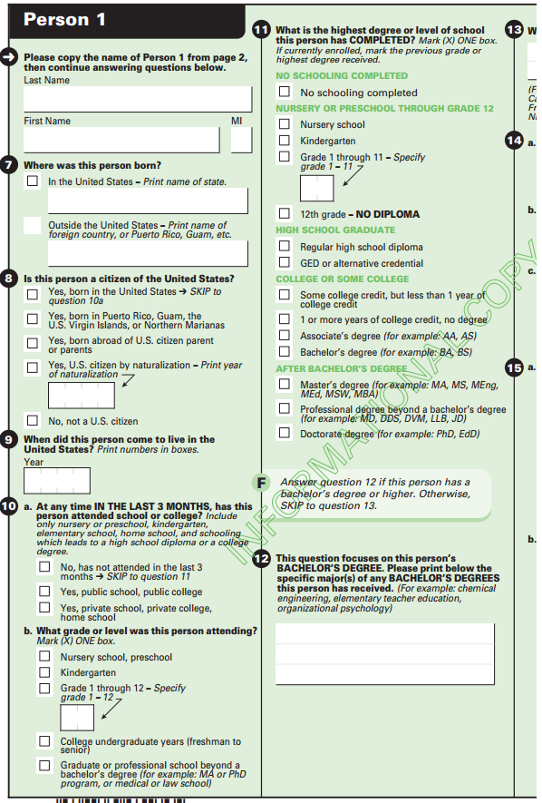
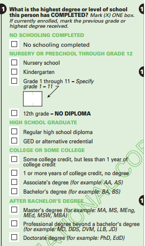
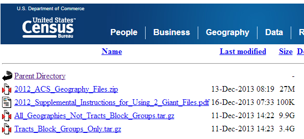

========================================================
author: Alex Shum
date: May 2014

Census Bureau
========================================================
- Agency responsible for collecting demographic data.
- Officially formed in 1903 under the department of commerce.
- Primary mission is to conduct the decennial census.

 

Census Data
========================================================
- Decennial census
- American community survey
- American housing survey
- Survey of construction
- National longitudinal survey
- Consumer Expenditure survey
- Surveys for other agencies: NSF, SSA, BLS and many other agencies.
  
Decennial Census
========================================================
- Mandated by Article I, Section 2 of the Constitution
- First census taken in 1790.
- Determines the number of seats in House of Representatives and number of Electoral College votes.
- Prior to 2010, the census included a "long form" containing additional demographic questions.
- 2010 Census removed the long form.  These questions now on American Community Survey.

Decennial Census
========================================================
- Short: Name, age, gender, race, marital status.
- Long: Place of birth, military service, salary.
- 2000 Census - $6.5 billion.  
- 2010 Census - $11 billion. 

Long form:
http://www.census.gov/dmd/www/pdf/d02p.pdf
Short form:
http://www.census.gov/dmd/www/pdf/d61a.pdf

American Community Survey
========================================================
- Replaces the census long form.
- Collects demographic variables including income, education, healthcare and many other variables.
- Unlike census, this survey is a yearly survey.
- Data sampled among US households.  Survey sent to 3 million addresses per year.
- 97% response rate.

American Community Survey
========================================================
  
 
 
<!--- http://www.census.gov/acs/www/Downloads/questionnaires/2014/Quest14.pdf -->

How can we access this data?
========================================================
- Various tools provided by the Census Bureau: factfinder, dataferret, quickfacts.
- http://factfinder2.census.gov/
- http://quickfacts.census.gov/
- http://dataferrett.census.gov/

How can we access this data?
========================================================
- The Census Bureau also provides the entire dataset for download.
- Files are quite large.


Online API
========================================================
- Can be accessed at: http://api.census.gov
- Request data as an HTTP GET request.
- The basic structure of the request:
http://api.census.gov/data/[YEAR]/[DATASET]?key=[KEY]&get=[VARIABLES]&for=[GEOGRAPHY]
- [YEAR]: year of dataset.
- [DATASET]: Which dataset to access.
- [KEY]: developer's key.
- [VARIABLES]: demographic variables.
- [GEOGRAPHY]: geographic area.

Online API - key & datasets
========================================================
- Developer's key available at: http://api.census.gov/data/key_signup.html
- 1990, 2000 and 2010 census.
- ACS datasets available in 5-year, 3-year and 1-year summary.
- ACS data range from 2006 to 2012.  ACS datasets not available for every year.
- Economic Time Series indicators.

<!--- http://www.census.gov/developers/ -->

Variables
========================================================
- http://api.census.gov/data/2012/acs5/variables.json
- Available variables posted in JSON format.
$$
\begin{verbatim}
"B27001_056E": {
  "label": "Female:!!75 years and over:!!With health insurance coverage",
  "concept": "B27001. Health Insurance Coverage Status by Sex by Age"
}
\end{verbatim}
$$
- A concept is a combination of factors from different questions on the ACS.
- A label is a combination of different levels of factors.
- A universe is the total number of people involved with a concept.

Geography
========================================================
- http://api.census.gov/data/2012/acs5/geography.json
- Available geographic entities posted in JSON format.
- Geographic entities correspond to different "summary levels".
- A "summary level" is a code for a combination of regions and used to represent the hierarchical nature of geography.
- Geographic regions: State, county, subdivision, tract, place, school district, zip code region, congressional district.
- Many combinations of geographic regions cannot be used together; valid combinations of regions will have a summary level code.

Geography
========================================================
010  <br />
020 <br />
030 <br />
040  <br />
050 <br />
060 <br />
140 <br />
860 <br />
970 <br />
***
United States  <br />
Region  <br />
Division  <br />
State  <br />
State-County  <br />
State-County-Subdivision  <br />
State-County-Tract  <br />
Zip Code Area  <br />
State-School District unified  <br />

Geography
========================================================
 


Geography
========================================================
 


Formatting
========================================================
Median income by gender and hours worked.  State level geography.

```
           male_total male_full male_other
Alabama         29556     45667      14669
Alaska          39792     60673      19015
Arizona         31794     46774      17777
Arkansas        26978     40919      14622
California      32630     52364      16553
Colorado        36651     52889      17561
```

total = overall median  <br />
full = full time  <br />
other = not full time  <br />

Formatting
========================================================
- Each concept has it's own data table.
- Each column of this table is a different label.
- Each row of this table is a location based on specified geography.
- Data not in tidy format.  Column headers provide categorical information.

Formatting
========================================================

```
       state gender part.full income
1    Alabama   male     total  29556
2     Alaska   male     total  39792
3    Arizona   male     total  31794
4   Arkansas   male     total  26978
5 California   male     total  32630
6   Colorado   male     total  36651
```


Taking a chance in the Classroom
========================================================
- Article by Morgan, Cetinkaya-Rundel, Stangl with classroom exercises based on ACS data.
- They use a much smaller sample of the ACS and their data is formatted much differently.

```
  Sex Age Married Income HoursWk  Race
1   0  31       0  60.00      40 white
2   1  31       0   0.36      12 black
3   1  75       0   0.00      NA white
4   0  80       0   0.00      NA white
5   1  64       1   0.00      NA white
6   1  14       0     NA      NA white
```


Taking a chance in the Classroom
========================================================
- In our sample of 1000 people, 861 have health inusrance and 139 do not.  Generate a confidence interval for the proportion of U.S. residents who do not have health insurance.

Proportions and Standard Errors
========================================================

Proportions and Standard Errors
========================================================

Extending the Exercises
========================================================

Extending the Exercises
========================================================

END
========================================================

